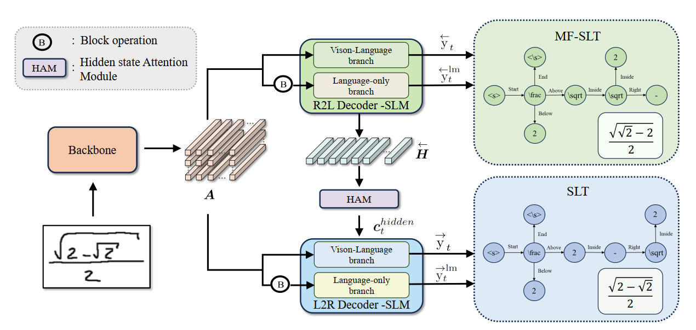

# Bidirectional Asynchrous Training (BAT) method for HMER
[Paper](https://arxiv.org/abs/2401.00435)

Offical implementation of Bidirectional Trained Tree-Structured Decoder for Handwritten Mathematical Expression Recognition

Under construction 

  
<b>Figure 1.</b> The architecture of BAT.

